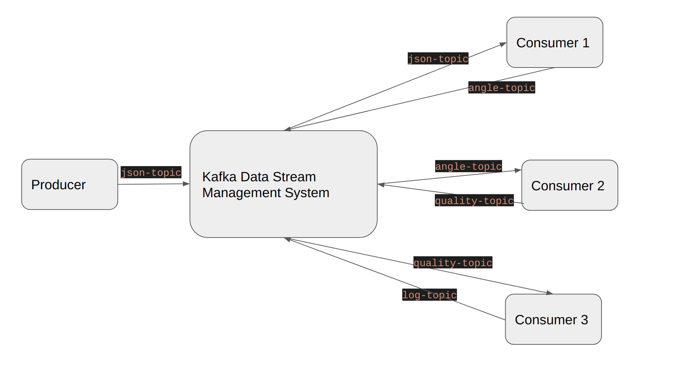

# Lab 4 and 5: streaming data management

### Objective: practice on streaming data management (with apach kafka):

### Assignment author: Mei Tao & Samir 

The flask_app will act as producer and send the exercise data alone with time stamp as "json-topic" to kafka.

We then use consumer 1 to read the “json-topic”, and use the coordinates of certain points of the body to calculate the angle. In our case, we choose to track the left shoulder and left elbow. We calculate the angle between the left arm and the body, and then send the angle with a timestamp back to kafka.

Consumer 2 will read the "angle-topic", using angle and the time stamp to calculate the angular speed, and we use a simple expert system to check whether the exercises have been executed correctly and generate quality factor ratios. There are 3 different exercises.

*Exercise 1: checkExerciseLength()*

This exercise will check whether the arm has been raised within a predefined interval. In state 0, we start the time, and check whether the angle is raised to 90 degrees. If this is the case, in state 1 the final time for raising the arm will be calculated. If the final time is within the predefined interval, a positive quality score will be given. If it is not the case, a negative quality score will be given. The quality scores will be combined to a ratio, by appending them as strings in the following format: positiveQuality1:negativeQuality1.

 *Exercise 2: checkNumberOfExercises()*

This exercise will check whether the exercise has been executed x number of times within a predefined interval. In state 0, we will start the time. In state 1, we check if the arm has been raised to 90 degrees, and increase a counter if this is the case. Then we go to state 3, where we check whether the counter has reached the desired value. If so, we stop the time, and calculate how long it took for the exercise to be executed. If the exercises have been done within predefined time, positive quality is increased.

 *Exercise 3: checkSpeedUpmovement()*

This exercise will check whether the arm is moved upwards (from 90 to 180 degrees), with a good angular speed. First, we check whether the angle of 90 degrees has been reached. If so, we check whether the angular speed is high enough. If so, the positive quality will be increased.

Consumer 2 then sends the quality factor ratios to kafka for other consumers to use.

Consumer 3 reads the "quality-topic", it calculates the ratio of good exercise vs bad exercise in a certain time interval, saves this in a local database, and also sends this to kafka.

