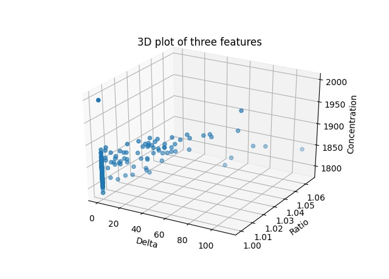
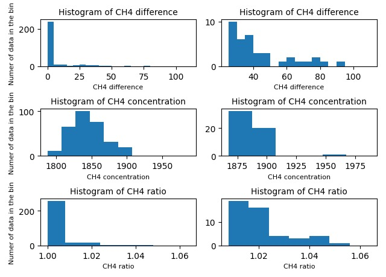
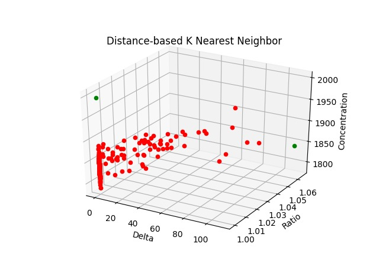
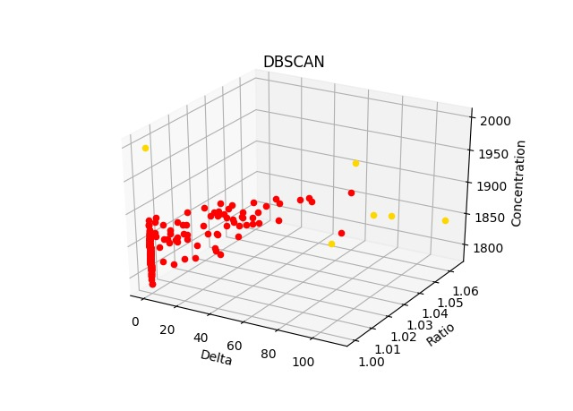
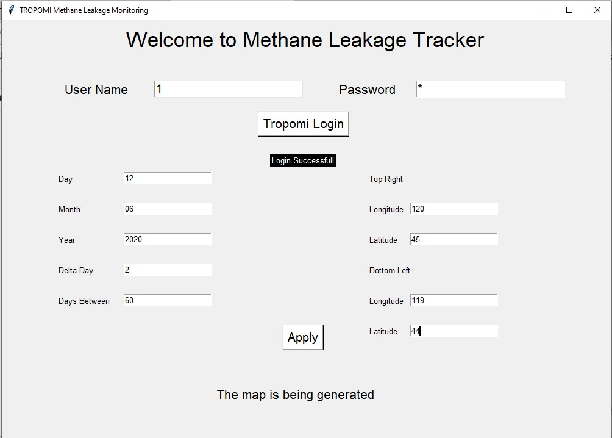
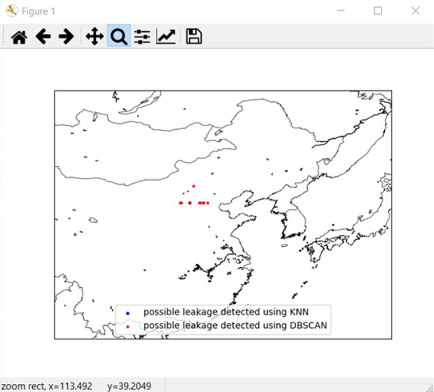
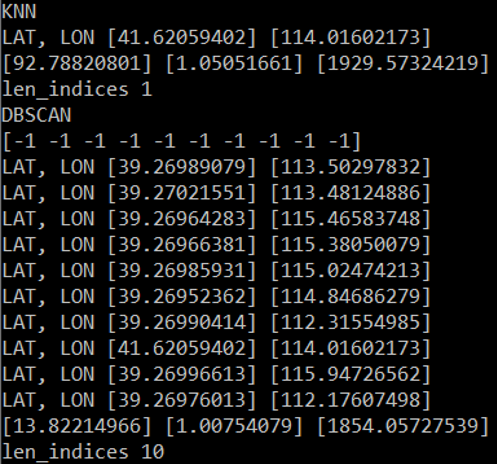

## Finding Methane leakages using TROPOMI data.

The code that tries to detect methane leakages is separated into two parts, called the producer and the consumer. They communicate with each other using kafka, a data stream management system. The producer takes an input, a selection of days and regions to look at, downloads the corresponding TROPOMI data and outputs the path at which the files are stored. The consumer receives the paths, extracts features and detects leakages using anomaly detection.

### TROPOMI data

Our group has worked on the L2 CH4 data. The reason to choose this data is because L2 CH4 consists of methane data exclusively when compared to that of L1 data which consists of data of various gases. The biggest influence for annual methane changes in China are coal mines (H.Yang, 2020). Therefore, the biggest coal mines in China have been found, and this area has been chosen for the analysis of methane. The main reason is that bigger methane concentrations are easier to identify using TROPOMI data. Below in figure 1 can be found the coordinates of the region that has been investigated.

### Features

When thinking about the features that could be used to detect leakages, our group first thought about using object detection techniques. However the nature of the data prohibits the use of these techniques. The data is not grid like we are used to from pictures where the distance in the real world is mapped evenly. In the TROPOMI dataset, the pixels are not evenly spaced out. In other words, the delta in longitude and latitude between two pixels is not a constant. Because of this, our group decided not to pursue extracting spatial characteristics. Instead, we only use temporal characteristics.

Because using only one pixel only gives us concentrations, we decided to track locations over time. We want to use features that tell us the concentration and the change in concentration both absolute(delta_ch4) and relative(ratio). To increase robustness we compare two time frames rather than two points in time.

When requesting TROPOMI data for an area and timeframe, the API returns all the images available that overlap with the selected area. Because the images sometimes overlap, first a function is used that combines the overlapping pixels. After the overlapping is done, we then compare between these two time frames to get the features. A visualization of three features set (methane concentration difference, concentration ratio and actual concentration) is shown below. From the plotted features we can tell that methane difference and ratio are highly correlated, we will try some anomaly detection techniques to find outliers. (and validate them?) 

<figure>
  
  <figcaption>Figure 2. 3D plot for three features</figcaption>
</figure>
<figure>
  
  <figcaption>Figure 3. Histograms</figcaption>
</figure>

### Choosing anomaly detection method
Varun Chandola, Arindam Banerjee, and Vipin Kumar. (2009) Anomaly Detection: A Survey https://dl.acm.org/doi/pdf/10.1145/1541880.1541882
#### Nature of input data
The input data is the features that we extracted. All the features are measures of concentration in time or at a point in time. There are multiple features, so the data is multivariate. The input data is point data; there is no relationship between one instance and another.
Because of the point based nature of the input data, contextual and collective anomaly detection is not applicable. We focus on point anomalies.

#### Data labels
Our team has searched for labeled methane leakages but there is no central database for that. Another option we tried is to take examples from the papers that found leakages. Often this data is not publicly available. Therefore we decided to focus on unsupervised anomaly detection. Using unsupervised anomaly detection, we have to make the assumption that anomalies are infrequent relative to the normal instances. We believe that this assumption is correct. If this assumption is not true then such techniques suffer from a high false alarm rate.

#### Output of Anomaly Detection
The two main output types of anomaly detection techniques are scores and labels. Scores are a measure of how anomalous the instance is considered. Labels are binary and tell you whether an instance is anomalous or not. Scores as output would be preferred but this is not a deal-breaker.

### Techniques

#### Classification-based
Classification-based anomaly detection techniques are not applicable because they only work on labeled data.

#### Nearest neighbor-based
Nearest neighbor-based anomaly detection techniques work on non-labeled data. They make the assumption that normal data instances occur in dense neighborhoods, while anomalies occur far from their closest neighbors.
These methods generally calculate an anomaly score using the distance to kth nearest neighbor, or using relative density.
For the distance-based nearest neighbour the anomaly score of a data instance is defined as its distance to its kth nearest neighbor in a given data set. Instances with a large distance to their kth nearest neighbor are considered to be anomalies.
We used distance-based K nearest neighbours to make predictions to our feature set, and visualize the outliers using a 3D plot. As can be seen in the plot, two points who have a large distance to their neighbours are considered outliers.

<figure>
  
  <figcaption>Figure 4. Distance based K nearest Neighbour</figcaption>
</figure>

Density-based anomaly detection techniques calculates the density of the neighborhood
of each data instance. Instances that fall into a low density neighbourhood are considered to be anomalous, while instances in neighbourhoods with a high density are considered to be normal. A plot of applying density-based K nearest neighbor on our data is shown below.

<figure>
  
  <figcaption>Figure 5. Distance based K nearest Neighbour</figcaption>
</figure>

The main disadvantage of nearest neighbor-based anomaly detection techniques is the bad computational performance.
Nearest neighbor-based anomaly detection techniques are a good fit if we can confirm that our data meets the assumption.

### Clustering-based

Clustering-based anomaly detection techniques work on non-labeled data. These techniques are categorized by the assumptions made on the input-data.
The first group makes the following assumption: normal data instances belong to a cluster in the data, while anomalies do not belong to any cluster. This requires a clustering algorithm that does not force instances into a cluster. As shown before, the outliers in our data set can form their own cluster, hence, our data doesn’t fit this assumption.

The second group makes the following assumption: normal data instances lie close to their closest cluster centroid, while anomalies are far away from their closest cluster centroid. K-Means clustering can be used for data under this assumption. We don’t believe this assumption is right.

The third group makes the following assumption: normal data instances belong to large and dense clusters, while anomalies either belong to small or sparse clusters. Techniques based on this assumption declare instances belonging to clusters whose size and/or density is below a threshold, as anomalous. A typical technique based on this assumption is CBLOF (Cluster-Based Local Outlier Factor), this technique will assign an anomaly score to each data instance, the score represents the size of the cluster to which the data instance belongs, as well as the distance of the data instance to its cluster centroid. And if the size and/or distance is below a threshold, the data instance is considered an anomaly. 
Another technique is DBSCAN (Density-based spatial clustering of applications with noise), it views clusters as areas of high density separated by areas of low density.
The computational performance is often bad for clustering-based techniques.

<figure>
  
  <figcaption>Figure 6. DBSCAN</figcaption>
</figure>

<figure>
  
  <figcaption>Figure 7. CBLOF</figcaption>
</figure>

#### Statistical-based
Statistical-based anomaly detection techniques rely on the following key assumption: Normal data instances occur in high probability regions of a stochastic model, while anomalies occur in the low probability regions of the stochastic model.
Within statistical-based anomaly detection, based on whether or not the model structure is pre-defined or determined from given data, it can be categorized into parametric and nonparametric techniques.
#### Spectral-based
Spectral techniques try to find an approximation of the data using a combination of attributes that capture the bulk of the variability in the data. Such techniques are based on the following key assumption: data can be embedded into a lower dimensional subspace in which normal instances and anomalies appear significantly different. It’s not clear to us  if this assumption can be satisfied and therefore decided not to pursue these techniques.
#### Chosen technique
Based on our assumption of our data set that anomaly instances are infrequent and occur far from their closest neighbors, the density-based clustering and distance-based K nearest neighbor method are chosen for anomaly detection.

### Designing a Graphical user interface for TROPOMI data visualization
#### Requirements for graphical user interface (GUI)
Before starting with the design and development of the graphical user interface, a set of requirements was created. The requirements can be seen below.
 A python script automates the detection of methane (CH4) leakages and (possible) developing leakages, and provides periodical reports;
a.      Automates: Download Tropomi data automatically from a specific period. TROPOMI files are fed to a python script, which will process the files and return the results automatically;
b.      CH4 leakages: a leakage is the activity of an increased methane concentration over a predefined period of days;
c.      provides periodical reports:  a report is created from a selected period in time;
2.      An anomaly detection algorithm is used to classify CH4 leakages;
a.      Anomaly detection algorithm: a thresholding algorithm based on a specific period entered by the user will filter any anomalies;
b.      Classify: classification is done based on K-Nearest Neighbors with algorithm based on density and distance
3.      The software of the graphical user interface (GUI) has an interface for sensor system management (choosing functions, changing points of views);   
a.      graphical user interface (GUI): a basic python-based GUI, which let’s user select a specific region for which he/she would like to get information about methane leakages or developing leakages. 
     a.    basic python-based GUI: a GUI in which a user enters the period in which the user would like to do anomaly detection and the coordinates (longitude and latitude), of the 2 points required to create a rectangle for area selection; 
b.    sensor system management: The following functions must be used: buttons for user input, input fields for user input and automatically generated messages on the screen in case the user give an incorrect input;
             b.    daily report: when a user wants a daily report of a certain region, the user enters required credentials (username and password), and the output is a visualization of  the point anomalies [SSS1];
             
### Approach used for GUI 
In order to visualise data from the two used python scripts (producer.py and consumer.py), we have used an approach which involves saving the input entered by the user in the GUI to a comma separated (csv) file.

We have used the Tkinter module in Python, which enables us to create a GUI. In the GUI, we give the user eleven entry prompts and a button to apply. We have used the .get() function which will return the content of a Tkinter entry widget. After the user presses ‘apply’, the entered fields are stored in the .csv file, ready to be used by producer.py.

The producer takes the .csv file as an input, and extracts the entered user information: day, month, year, latitude and longitude. Then, the producer runs the producer script, and sends the output as a stream to the consumer by using kafka. 

The consumer takes the input data from the producer through its address topic sent by the kafka streamer, and processes all the necessary input fields and makes features out of it. The results of anomaly detection are presented in another window, which is shown after the consumer.py is run on the background of the GUI. Results are presented in a basemap.

#### Design for GUI
<figure>
  
  <figcaption>Figure 8. Design of GUI</figcaption>
</figure>
For the GUI system we have the prompt entries which are listed as the Username, Password, and at the top left we have the following entries: Day, Month, Year, Delta day, Days between and for the top right we have the longitude, latitude.
There are two types of users which can use the GUI: group 1 (students, researchers and teachers) and group 2 (professionals and companies). Group 2 normally has access to professional features, such as a list of companies linked to specific coordinates. However, this has not been implemented yet.

For this GUI we had to consider some standards and models which were used for the design such as the use of ISO TC159/SC4. This is a standard for the user system interface and symbols for developing standards for minimum levels of user performance and monitoring the use of interface implications of other standards. Also, the JTC1/SC18/WG9 and TC159/SC4 standards have been used, which are guidelines for minimum levels of user performance that can permit complete freedom of implementation, and subtly having the menus, coding and formatting, user guidance and the visual display ergonomics.

#### Requirements check

The requirements listed were implemented and the GUI works on a python platform. The TROPOMI data visualization process has been automated. Therefore, req.1 has been fulfilled. 
The user interface asks for login credentials and once it is verified true, gives the options to the user to input the day, month, year and days between along with delta day. The UI also gives the option to enter the latitudes and longitudes for creating a polygon region for which the user wants to visualize the methane leakage data. After all inputs are placed, the user is provided with an apply button which is mapped to the producer of the kafka streamer. Therefore, req.3 has been fulfilled. The producer fetches all the necessary nc files required to analyse and refers to the coordinates of the polygon. This is the automatic downloading of the tropomi data. The producer then sends the information to the consumer, in this case the consumer has to be manually started as we haven’t figured out how to call two python scripts from the GUI itself. This has been noted as a future improvement. The consumer script then develops the features and performs the classification to generate the outliers for the methane leakages, using K-nearest neighbor anomaly detection technique. Therefore, req.2 has been fulfilled. The consumer also includes different methods of detecting a leakage which has been already stated. The output of one such technique (anomaly detection) is then fed to the basemap to visualize the leakage data to have a better insight. Inside the consumer, there is another user interface part which is basically used to pop up another window with the picturisation of the region having methane leakage.

### Discussion
In the developed design, all the code runs serially. The nature of the data pushed us in a direction where the code is very computationally intense. In future work, or if we had more time, we would have processed the data using GPU instead of only using CPU or multiple CPU cores. One of the limitations of our work is that we have to compare two short time periods with a fixed time gap due to computational limitation. Longer time periods and comparing various time gaps would give a more robust result. And since we cannot get enough methane leakage data with labels, it’s difficult to validate the performance of our model.

We had to make two assumptions about the nature of the normal and anomalous instances: 
1.Anomalies are infrequent relative to the normal instances.
2. Normal data instances occur in dense neighborhoods, while anomalies occur far from their closest neighbors.
We don’t have the means to verify these assumptions. If these assumptions don’t hold true, the TPR and TNR will be low.

The GUI built is functional, however it is very basic and does not provide functionality for professional users. The GUI currently runs the producer.py and consumer.py scripts serially, however this could be parallelized in order to speed up the processing speed. Also, the results are shown in a new window of the GUI, this can be implemented in the same GUI window in the future. Normally, after the GUI is started the consumer.py and producer.py scripts will be executed. However, in order to accomplish this 2 terminals are required. The GUI is started from an IDE, which only has one terminal. Therefore, one terminal window has to be opened with the consumer.py code running. After pressing the ‘apply’ button in the GUI, the producer.py script is launched automatically, and the output is plotted in a new window. The output is described in section “GUI with leakage points”.

### GUI with Leakage Points

The output of the GUI can be seen below. The legend lists 2 types of anomaly detection techniques: K-nearest neighbor (KNN) in blue and density-based spacial clustering with applications of noise (DBSCAN) in red. There is 1 leakage found for KNN (overlapping point in the middle of the graph, coordinates 113.492, 39.2049 as listed in figure x below), and 10 leakages for DBSCAN. It can be concluded that the DBSCAN anomaly detection technique performs better with smaller selected areas. The selected area for anomaly detection was based on higher methane activity from the larger coal mines in China (close to approximately 110º, 39º). The coordinates of the anomalies can be seen in figure x2.
<figure>
  
  <figcaption>Figure 9. anomalies found using KNN and DBSCAN</figcaption>
</figure>

Figure 2x first lists the coordinates of the point anomaly found using the KNN anomaly detection method, then the coordinates found using DBSCAN detection method. When comparing the found coordinates with the location of the coal mines, we can see that the closest point of the coordinates listed is 39.269º, 112.176º. The distance between this point and the coal mines is approximately 115km. Since the TROPOMI satellite data has a spatial resolution of 7x7km, we can conclude that our assumption was wrong: the largest coal mines in China do not produce more methane compared to other regions in the search area.

<figure>
  
  <figcaption>Figure 10. coordinates of found anomalies</figcaption>
</figure>

## Authors: Mei Tao, Charmy, Samire, Abhirup, Dirk